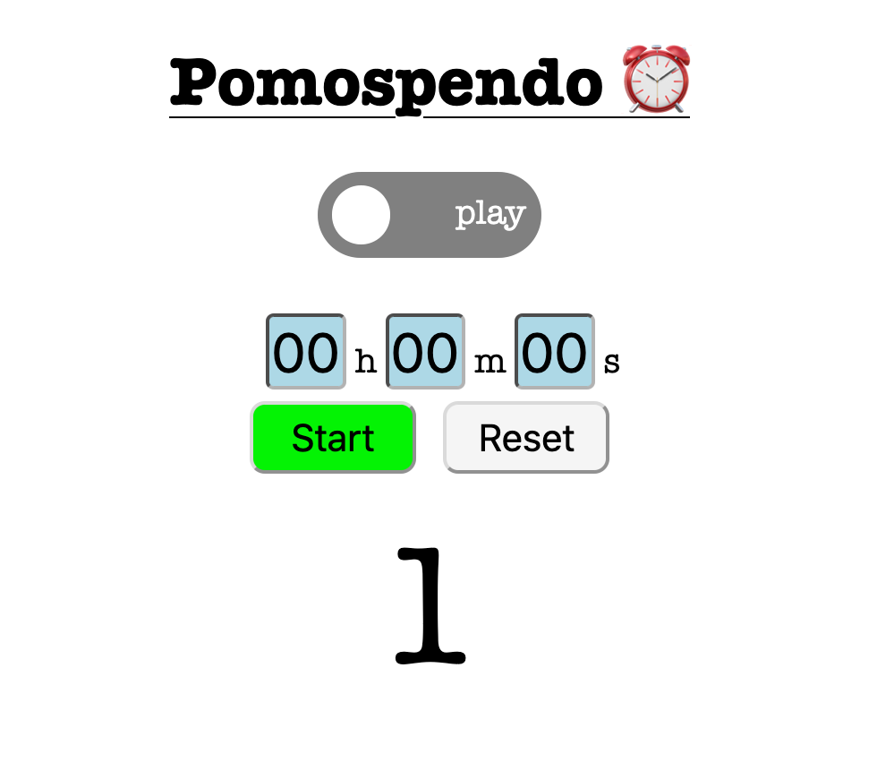

# Description
This is a web-based Pomodoro application that enables you to keep track of how many [Pomodoros](https://en.wikipedia.org/wiki/Pomodoro_Technique) you've done, then lets you "spend" those Pomodoros on something fun! Here's what the UI currently looks like when in "work" mode:

...and "play" mode looks very similar:

This is an experiment in refining the relationship between work and play by giving users clear indicators of progress that are directly tied to a "fun budget" they can choose to spend at any time. Want to work for 25 minutes, then play for 25 minutes? No problem! I'm fairly certain the kernel of this idea was originally inspired by a post I found on [HN](https://news.ycombinator.com/), though I can no longer seem to find it.

**Note**: The application currently uses [`localStorage`](https://developer.mozilla.org/en-US/docs/Web/API/Window/localStorage) in order to maintain the current count of Pomodoros completed between browser sessions.  

**Note**: It is currently possible for users to go into "debt" by doing more "play" Pomodoros than "work" Pomodoros. In the future, I may make this "debt" feature optional, but for now I thought it was kind of funny to leave in there.

# Feature Roadmap
Below are some features I'd like to add in order to make the application better:
- [] Add settings that enable one to switch to light/dark mode
- [] Add settings to clear the Pomodoro count
- [] Add sound for when the Pomodoro timer is complete and give users the ability to optionally enable this
- [] Make Pomodoro "debt" an optional feature
- [] Add an 'About' page or sidebar

# TODOs
Below are some important TODO items I need to complete before the application is suitable for regular use:
- [] Sanitize timer inputs to only allow digits
- [] Learn about CSS media queries and use these to optimize the site for mobile/tablet usage
- [] Improve UX for entering time duration values